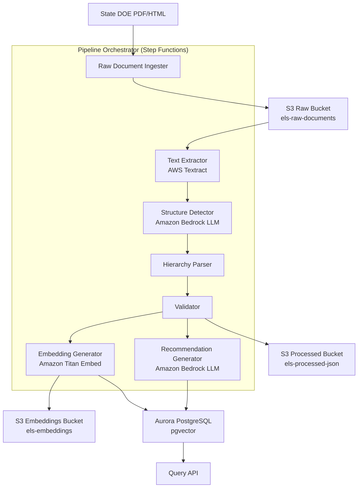
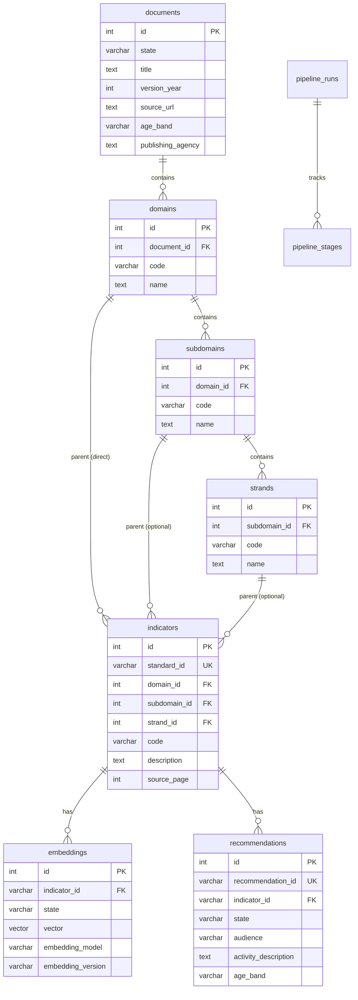

# Design Document: ELS Normalization Pipeline

## Overview

The ELS Normalization Pipeline transforms raw early learning standards documents from state Departments of Education into a machine-readable, queryable corpus with a consistent four-level hierarchy. The system uses AWS services (S3, Textract, Bedrock, Aurora PostgreSQL with pgvector) to ingest PDFs, extract text, detect structure via LLM-assisted parsing, normalize terminology, validate against a canonical schema, generate embeddings, produce parent/teacher recommendations, and persist everything in a versioned data store.

The pipeline is implemented in Python and deployed as a set of AWS Lambda functions orchestrated by AWS Step Functions. Each stage is independently re-runnable and produces traceable artifacts.

## Architecture



### Key Architectural Decisions

1. **AWS Step Functions for orchestration**: Provides built-in retry, error handling, stage-level re-execution, and execution history — directly satisfying Requirement 9's traceability needs.
2. **Lambda per stage**: Each pipeline stage runs as an independent Lambda function. This enables independent scaling, isolated failure, and stage-level re-runs.
3. **Python**: Chosen for strong AWS SDK support (boto3), Textract response parsing libraries, and mature JSON schema validation tooling.
4. **Aurora PostgreSQL with pgvector**: Combines relational storage for the normalized hierarchy with vector similarity search in a single engine, avoiding a separate vector database.
5. **S3 versioning for all buckets**: Every artifact (raw, processed, embeddings) is versioned at the S3 level, providing immutable audit trails.

## Components and Interfaces

### 1. Raw Document Ingester (`ingester.py`)

Receives an upload event (S3 trigger or API call), validates the file format, stores the document in S3 with the path convention `{state}/{year}/{filename}`, and writes ingestion metadata.

```python
class IngestionRequest:
    file_path: str          # Local or presigned URL path
    state: str              # Two-letter state code
    version_year: int
    source_url: str
    publishing_agency: str
    filename: str

class IngestionResult:
    s3_key: str
    s3_version_id: str
    metadata: dict          # state, version_year, source_url, publishing_agency, upload_timestamp
    status: str             # "success" | "error"
    error: str | None

def ingest_document(request: IngestionRequest) -> IngestionResult: ...
```

**Format validation**: Checks file extension and MIME type. Supported: `.pdf`, `.html`. Returns descriptive error for unsupported formats.

### 2. Text Extractor (`extractor.py`)

Calls AWS Textract on the stored PDF, parses the response into ordered text blocks with page numbers and table structure preserved.

```python
class TextBlock:
    text: str
    page_number: int
    block_type: str         # "LINE" | "TABLE_CELL" | "TABLE"
    row_index: int | None   # For table cells
    col_index: int | None   # For table cells
    confidence: float       # Textract confidence
    geometry: dict          # Bounding box from Textract

class ExtractionResult:
    document_s3_key: str
    blocks: list[TextBlock]
    total_pages: int
    status: str
    error: str | None

def extract_text(s3_key: str, s3_version_id: str) -> ExtractionResult: ...
```

**Reading order**: Blocks are sorted by page number, then by vertical position (top of bounding box), then by horizontal position (left of bounding box).

**Table handling**: Table cells retain `row_index` and `col_index` so downstream consumers can reconstruct tabular data.

### 3. Structure Detector (`detector.py`)

Sends text block chunks to an LLM via Amazon Bedrock to classify each element's hierarchy level, label, and content type.

```python
class DetectedElement:
    level: str              # "domain" | "subdomain" | "strand" | "indicator"
    code: str               # Detected code/numbering (e.g., "LLD", "LLD.A.1")
    title: str
    description: str
    confidence: float       # 0.0–1.0
    source_page: int
    source_text: str        # Original text chunk
    needs_review: bool      # True if confidence < 0.7

class DetectionResult:
    document_s3_key: str
    elements: list[DetectedElement]
    review_count: int       # Number of elements flagged for review
    status: str
    error: str | None

def detect_structure(blocks: list[TextBlock]) -> DetectionResult: ...
```

**Chunking strategy**: Text blocks are grouped into chunks of ~2000 tokens with overlap to preserve context across chunk boundaries. Each chunk is sent to Bedrock with a structured prompt that asks the LLM to return a JSON array of classified elements.

**Confidence threshold**: Elements with `confidence < 0.7` are included in the result but marked `needs_review = True` and excluded from automated downstream processing.

### 4. Hierarchy Parser (`parser.py`)

Assembles detected elements into a normalized four-level tree and generates deterministic Standard_IDs.

```python
class HierarchyNode:
    level: str              # "domain" | "subdomain" | "strand" | "indicator"
    code: str
    name: str
    description: str | None # Only indicators have descriptions
    children: list["HierarchyNode"]

class NormalizedStandard:
    standard_id: str        # e.g., "CA-2021-LLD-1.2"
    state: str
    version_year: int
    domain: HierarchyLevel
    subdomain: HierarchyLevel | None
    strand: HierarchyLevel | None
    indicator: HierarchyLevel
    source_page: int
    source_text: str

class HierarchyLevel:
    code: str
    name: str
    description: str | None # Only for indicator level

class ParseResult:
    standards: list[NormalizedStandard]
    orphaned_elements: list[DetectedElement]  # Elements that couldn't be placed
    status: str
    error: str | None

def parse_hierarchy(
    elements: list[DetectedElement],
    state: str,
    version_year: int
) -> ParseResult: ...
```

**Depth normalization logic**:

- Detect the number of distinct hierarchy levels present in the input elements
- 2 levels → top = Domain, bottom = Indicator, Subdomain = null, Strand = null
- 3 levels → top = Domain, middle = Subdomain, bottom = Indicator, Strand = null
- 4+ levels → top = Domain, 2nd = Subdomain, 3rd = Strand, lowest = Indicator

**Standard_ID generation**: `f"{state}-{version_year}-{domain.code}-{indicator.code}"` — deterministic and reproducible from the same input.

**Orphan detection**: After tree assembly, any element that does not have a path to a Domain is reported in `orphaned_elements`.

### 5. Validator (`validator.py`)

Validates Canonical_JSON records against the schema and business rules.

```python
class ValidationError:
    field_path: str         # e.g., "standard.domain.code"
    message: str
    error_type: str         # "missing_field" | "invalid_type" | "uniqueness" | "format"

class ValidationResult:
    is_valid: bool
    errors: list[ValidationError]
    record: dict | None     # The validated record if valid

def validate_record(record: dict) -> ValidationResult: ...
def serialize_record(standard: NormalizedStandard, document_meta: dict, page_meta: dict) -> dict: ...
def deserialize_record(json_data: dict) -> NormalizedStandard: ...
```

**Schema enforcement**: Uses JSON Schema validation for structural checks, plus custom rules for:

- Standard_ID uniqueness within state+year
- Required fields at each level
- Nullable subdomain/strand only when hierarchy depth < 4

**Round-trip guarantee**: `deserialize_record(json.loads(json.dumps(serialize_record(s))))` produces an equivalent `NormalizedStandard`.

### 6. Embedding Generator (`embedder.py`)

Constructs contextual embedding input text and calls Amazon Titan Embed Text v1.

```python
class EmbeddingRecord:
    indicator_id: str
    state: str
    vector: list[float]
    embedding_model: str    # "amazon.titan-embed-text-v1"
    embedding_version: str  # "v1", "v2", etc.
    created_at: str         # ISO 8601 timestamp
    input_text: str         # The text that was embedded

class EmbeddingResult:
    records: list[EmbeddingRecord]
    status: str
    error: str | None

def build_embedding_input(standard: NormalizedStandard) -> str: ...
def generate_embeddings(standards: list[NormalizedStandard]) -> EmbeddingResult: ...
```

**Input text construction**: Concatenates non-null hierarchy levels:

```
"{domain.name} – {subdomain.name} – {strand.name} – {indicator.description} Age {age_band}."
```

Null levels are omitted from the concatenation.

### 7. Recommendation Generator (`recommender.py`)

Produces actionable, audience-specific recommendations for parents and teachers.

```python
class Recommendation:
    recommendation_id: str
    indicator_id: str
    state: str
    audience: str           # "parent" | "teacher"
    activity_description: str
    age_band: str
    generation_model: str
    created_at: str

class RecommendationRequest:
    state: str
    indicator_ids: list[str] | None   # Specific indicators, or None for domain/subdomain level
    domain_code: str | None           # For domain-level aggregation
    subdomain_code: str | None        # For subdomain-level aggregation
    age_band: str

class RecommendationResult:
    recommendations: list[Recommendation]
    status: str
    error: str | None

def generate_recommendations(request: RecommendationRequest) -> RecommendationResult: ...
```

**State scoping**: The generator queries only indicators matching `request.state` — no cross-state data is included in the LLM context or output.

**Actionability enforcement**: The LLM prompt explicitly requires a concrete activity or strategy. If the response lacks one (detected via keyword heuristics: must contain an action verb and a specific noun), the generator retries with a refined prompt up to 2 additional attempts.

**Domain/subdomain aggregation**: When `domain_code` or `subdomain_code` is provided without specific `indicator_ids`, the generator fetches all indicators under that level, groups them, and asks the LLM for holistic recommendations spanning the grouped skills.

### 8. Pipeline Orchestrator (`orchestrator.py` + Step Functions definition)

AWS Step Functions state machine that chains all stages with error handling and traceability.

```python
class PipelineStageResult:
    stage_name: str
    status: str             # "success" | "failure"
    duration_ms: int
    output_artifact: str    # S3 key or DB reference
    error: str | None

class PipelineRunResult:
    run_id: str
    document_s3_key: str
    stages: list[PipelineStageResult]
    total_indicators: int
    total_validated: int
    total_embedded: int
    total_recommendations: int
    status: str             # "completed" | "failed" | "partial"

def start_pipeline(s3_key: str, state: str, version_year: int) -> str: ...  # Returns run_id
def rerun_stage(run_id: str, stage_name: str) -> PipelineStageResult: ...
def get_pipeline_status(run_id: str) -> PipelineRunResult: ...
```

**Stage execution order**: ingestion → text_extraction → structure_detection → hierarchy_parsing → validation → embedding_generation → recommendation_generation → data_persistence

**Failure handling**: On stage failure, Step Functions catches the error, records it in the stage result, and transitions to a failure state. Partial results from completed stages remain accessible.

**Re-run support**: Each stage reads its input from the previous stage's output artifact in S3, so any stage can be re-executed independently by providing the run_id and stage name.

### 9. Data Access Layer (`db.py`)

Manages Aurora PostgreSQL connections and provides query interfaces.

```python
def persist_standard(standard: NormalizedStandard, document_meta: dict) -> None: ...
def persist_embedding(record: EmbeddingRecord) -> None: ...
def persist_recommendation(rec: Recommendation) -> None: ...
def query_similar_indicators(vector: list[float], top_k: int, filters: dict) -> list[dict]: ...
def get_indicators_by_state(state: str, domain_code: str | None, subdomain_code: str | None) -> list[dict]: ...
```

## Data Models

### Canonical JSON Schema

```json
{
  "state": "CA",
  "document": {
    "title": "California Preschool Learning Foundations",
    "version_year": 2021,
    "source_url": "https://...",
    "age_band": "3-5",
    "publishing_agency": "California Department of Education"
  },
  "standard": {
    "standard_id": "CA-2021-LLD-1.2",
    "domain": {
      "code": "LLD",
      "name": "Language and Literacy Development"
    },
    "subdomain": {
      "code": "LLD.A",
      "name": "Listening and Speaking"
    },
    "strand": {
      "code": "LLD.A.1",
      "name": "Comprehension"
    },
    "indicator": {
      "code": "LLD.A.1.a",
      "description": "Child demonstrates understanding of increasingly complex language."
    }
  },
  "metadata": {
    "page_number": 43,
    "source_text_chunk": "...",
    "last_verified": "2026-02-08"
  }
}
```

### Database Schema (Aurora PostgreSQL)

```sql
CREATE EXTENSION IF NOT EXISTS vector;

CREATE TABLE documents (
    id SERIAL PRIMARY KEY,
    state VARCHAR(2) NOT NULL,
    title TEXT NOT NULL,
    version_year INTEGER NOT NULL,
    source_url TEXT,
    age_band VARCHAR(10) NOT NULL,
    publishing_agency TEXT NOT NULL,
    created_at TIMESTAMP DEFAULT NOW(),
    UNIQUE(state, version_year, title)
);

CREATE TABLE domains (
    id SERIAL PRIMARY KEY,
    document_id INTEGER REFERENCES documents(id),
    code VARCHAR(20) NOT NULL,
    name TEXT NOT NULL,
    UNIQUE(document_id, code)
);

CREATE TABLE subdomains (
    id SERIAL PRIMARY KEY,
    domain_id INTEGER REFERENCES domains(id),
    code VARCHAR(30) NOT NULL,
    name TEXT NOT NULL,
    UNIQUE(domain_id, code)
);

CREATE TABLE strands (
    id SERIAL PRIMARY KEY,
    subdomain_id INTEGER REFERENCES subdomains(id),
    code VARCHAR(40) NOT NULL,
    name TEXT NOT NULL,
    UNIQUE(subdomain_id, code)
);

CREATE TABLE indicators (
    id SERIAL PRIMARY KEY,
    standard_id VARCHAR(50) UNIQUE NOT NULL,
    domain_id INTEGER REFERENCES domains(id) NOT NULL,
    subdomain_id INTEGER REFERENCES subdomains(id),
    strand_id INTEGER REFERENCES strands(id),
    code VARCHAR(50) NOT NULL,
    description TEXT NOT NULL,
    source_page INTEGER,
    source_text TEXT,
    last_verified DATE,
    created_at TIMESTAMP DEFAULT NOW()
);

CREATE TABLE embeddings (
    id SERIAL PRIMARY KEY,
    indicator_id VARCHAR(50) REFERENCES indicators(standard_id),
    state VARCHAR(2) NOT NULL,
    vector vector(1536),
    embedding_model VARCHAR(100) NOT NULL,
    embedding_version VARCHAR(10) NOT NULL,
    input_text TEXT NOT NULL,
    created_at TIMESTAMP DEFAULT NOW()
);

CREATE TABLE recommendations (
    id SERIAL PRIMARY KEY,
    recommendation_id VARCHAR(100) UNIQUE NOT NULL,
    indicator_id VARCHAR(50) REFERENCES indicators(standard_id),
    state VARCHAR(2) NOT NULL,
    audience VARCHAR(10) NOT NULL CHECK (audience IN ('parent', 'teacher')),
    activity_description TEXT NOT NULL,
    age_band VARCHAR(10) NOT NULL,
    generation_model VARCHAR(100) NOT NULL,
    created_at TIMESTAMP DEFAULT NOW()
);

CREATE TABLE pipeline_runs (
    id SERIAL PRIMARY KEY,
    run_id VARCHAR(100) UNIQUE NOT NULL,
    document_s3_key TEXT NOT NULL,
    state VARCHAR(2) NOT NULL,
    version_year INTEGER NOT NULL,
    status VARCHAR(20) NOT NULL DEFAULT 'running',
    total_indicators INTEGER DEFAULT 0,
    total_validated INTEGER DEFAULT 0,
    total_embedded INTEGER DEFAULT 0,
    total_recommendations INTEGER DEFAULT 0,
    started_at TIMESTAMP DEFAULT NOW(),
    completed_at TIMESTAMP
);

CREATE TABLE pipeline_stages (
    id SERIAL PRIMARY KEY,
    run_id VARCHAR(100) REFERENCES pipeline_runs(run_id),
    stage_name VARCHAR(50) NOT NULL,
    status VARCHAR(20) NOT NULL,
    duration_ms INTEGER,
    output_artifact TEXT,
    error TEXT,
    completed_at TIMESTAMP DEFAULT NOW()
);

-- Indexes for common query patterns
CREATE INDEX idx_indicators_state ON indicators(standard_id);
CREATE INDEX idx_embeddings_state ON embeddings(state);
CREATE INDEX idx_embeddings_vector ON embeddings USING ivfflat (vector vector_cosine_ops) WITH (lists = 100);
CREATE INDEX idx_recommendations_state_indicator ON recommendations(state, indicator_id);
CREATE INDEX idx_recommendations_audience ON recommendations(audience);
```

### Mermaid ER Diagram



## Correctness Properties

_A property is a characteristic or behavior that should hold true across all valid executions of a system — essentially, a formal statement about what the system should do. Properties serve as the bridge between human-readable specifications and machine-verifiable correctness guarantees._

### Property 1: S3 Path Construction

_For any_ valid state code, version year, and filename/standard_id, the constructed S3 key SHALL match the pattern `{state}/{year}/{identifier}` — no leading slashes, no double slashes, and all components present.

**Validates: Requirements 1.1, 5.5**

### Property 2: Ingestion Metadata Completeness

_For any_ successful ingestion result, the metadata dictionary SHALL contain non-empty values for all required keys: state, version_year, source_url, publishing_agency, and upload_timestamp.

**Validates: Requirements 1.2**

### Property 3: Format Validation Correctness

_For any_ file with extension in {".pdf", ".html"}, the format validator SHALL accept it. _For any_ file with an extension outside that set, the format validator SHALL reject it with a non-empty error message.

**Validates: Requirements 1.4**

### Property 4: Text Block Reading Order

_For any_ set of text blocks with page numbers and bounding box positions, the ordering function SHALL produce a sequence sorted by (page_number ASC, top_position ASC, left_position ASC).

**Validates: Requirements 2.2**

### Property 5: Table Cell Structure Preservation

_For any_ text block with `block_type = "TABLE_CELL"`, the block SHALL have non-null, non-negative `row_index` and `col_index` values.

**Validates: Requirements 2.3**

### Property 6: Page Number Presence

_For any_ text block in an extraction result, the `page_number` field SHALL be a positive integer.

**Validates: Requirements 2.4**

### Property 7: Detected Element Field Validity

_For any_ detected element returned by the Structure Detector, the `confidence` SHALL be in the range [0.0, 1.0] and the `level` SHALL be one of {"domain", "subdomain", "strand", "indicator"}.

**Validates: Requirements 3.2, 3.3**

### Property 8: Confidence Threshold Flagging

_For any_ detected element, if `confidence < 0.7` then `needs_review` SHALL be True, and if `confidence >= 0.7` then `needs_review` SHALL be False.

**Validates: Requirements 3.4**

### Property 9: Canonical Level Normalization

_For any_ set of detected elements with arbitrary level labels, the Hierarchy Parser output SHALL contain only levels from the set {"domain", "subdomain", "strand", "indicator"}.

**Validates: Requirements 4.1**

### Property 10: Depth-Based Hierarchy Mapping

_For any_ set of detected elements with N distinct hierarchy levels:

- If N = 2: output standards SHALL have domain and indicator populated, subdomain and strand null
- If N = 3: output standards SHALL have domain, subdomain, and indicator populated, strand null
- If N >= 4: output standards SHALL have all four levels populated

**Validates: Requirements 4.2, 4.3, 4.4**

### Property 11: Standard_ID Determinism

_For any_ given (state, version_year, domain_code, indicator_code) tuple, calling the Standard_ID generator twice SHALL produce identical results.

**Validates: Requirements 4.5**

### Property 12: No Orphaned Indicators

_For any_ valid parse result, every standard in the `standards` list SHALL have a non-null `domain`. Any element that cannot be placed in the tree SHALL appear in `orphaned_elements` and not in `standards`.

**Validates: Requirements 4.6**

### Property 13: Schema Validation Rejects Invalid Records

_For any_ Canonical_JSON record missing any required field (state, document.title, document.version_year, document.source_url, document.age_band, document.publishing_agency, standard.standard_id, standard.domain.code, standard.domain.name, standard.indicator.code, standard.indicator.description, or metadata), the Validator SHALL return `is_valid = False`.

**Validates: Requirements 5.1, 5.2, 5.3**

### Property 14: Validation Error Reporting

_For any_ invalid Canonical_JSON record, the Validator SHALL return at least one ValidationError with a non-empty `field_path` and non-empty `message`.

**Validates: Requirements 5.6**

### Property 15: Standard_ID Uniqueness Enforcement

_For any_ set of Canonical_JSON records containing two records with the same standard_id, state, and version_year, the Validator SHALL detect and report the uniqueness violation.

**Validates: Requirements 5.7**

### Property 16: Serialization Round Trip

_For any_ valid NormalizedStandard object, serializing to JSON via `serialize_record` and then deserializing via `deserialize_record` SHALL produce an object equivalent to the original.

**Validates: Requirements 5.8**

### Property 17: Embedding Input Text Construction

_For any_ NormalizedStandard, the embedding input text SHALL contain the domain name, indicator description, and age band. If subdomain is non-null, the text SHALL contain the subdomain name. If strand is non-null, the text SHALL contain the strand name. If subdomain or strand is null, the text SHALL NOT contain placeholder text for those levels.

**Validates: Requirements 6.1**

### Property 18: Embedding Record Completeness

_For any_ embedding record, the fields indicator_id, state, vector (non-empty list), embedding_model, embedding_version, and created_at SHALL all be present and non-empty.

**Validates: Requirements 6.3**

### Property 19: Vector Similarity Ordering

_For any_ query vector and set of stored embedding vectors, the results returned by `query_similar_indicators` SHALL be ordered by decreasing cosine similarity.

**Validates: Requirements 7.3**

### Property 20: Query Filter Correctness

_For any_ similarity query with a state filter, all returned indicators SHALL have a `state` value matching the filter. The same holds for age_band, domain, and version_year filters.

**Validates: Requirements 7.4**

### Property 21: Recommendation Audience Coverage

_For any_ indicator-level recommendation request, the result SHALL contain at least one recommendation with `audience = "parent"` and at least one with `audience = "teacher"`.

**Validates: Requirements 8.1**

### Property 22: Recommendation Prompt Context

_For any_ recommendation generation call, the prompt sent to the LLM SHALL include the indicator description, the parent hierarchy names (domain, subdomain if present, strand if present), and the age band.

**Validates: Requirements 8.2**

### Property 23: Recommendation Record Completeness

_For any_ recommendation record, the fields recommendation_id, indicator_id, state, audience (one of "parent" or "teacher"), activity_description (non-empty), age_band, generation_model, and created_at SHALL all be present and valid.

**Validates: Requirements 8.3, 8.6**

### Property 24: Actionability Validation

_For any_ recommendation text, the actionability checker SHALL return True only if the text contains at least one action verb and at least one specific noun describing a concrete activity or strategy.

**Validates: Requirements 8.5**

### Property 25: Recommendation State Scoping

_For any_ recommendation request specifying a state, all returned recommendations SHALL reference indicators belonging to that state only. No indicator_id from a different state SHALL appear in the results.

**Validates: Requirements 8.7**

### Property 26: Pipeline Stage Result Completeness

_For any_ completed pipeline stage result, the fields stage_name, status, duration_ms (non-negative), and output_artifact SHALL all be present.

**Validates: Requirements 9.2**

### Property 27: Pipeline Run Counts Invariant

_For any_ successfully completed pipeline run, `total_validated <= total_indicators` and `total_embedded <= total_validated`.

**Validates: Requirements 9.4**

## Error Handling

### Ingestion Errors

- Unsupported file format → return `IngestionResult` with `status="error"` and descriptive message including the rejected format and supported formats
- S3 upload failure → retry up to 3 times with exponential backoff, then fail with S3 error details

### Text Extraction Errors

- Textract service failure → log with document S3 key and error, return `ExtractionResult` with `status="error"`
- Empty extraction output → treat as failure, log warning, return error result
- Timeout on large documents → configure Textract async mode with SNS notification for documents > 50 pages

### Structure Detection Errors

- Bedrock API failure → retry up to 2 times, then fail the stage
- LLM returns malformed JSON → log the raw response, retry with the same chunk, fail after 2 retries
- Low confidence elements (< 0.7) → flag for review, exclude from automated pipeline, include in detection result for manual inspection

### Hierarchy Parsing Errors

- Orphaned elements (no parent path to domain) → report in `orphaned_elements`, do not include in `standards`
- Duplicate Standard_IDs → log conflict, append a disambiguating suffix, flag for review
- Zero indicators detected → fail the stage with descriptive error

### Validation Errors

- Schema violations → collect all errors (don't fail on first), return complete error list with field paths
- Uniqueness violations → report all duplicates with their standard_ids
- Round-trip mismatch → log both original and round-tripped versions for debugging

### Embedding Errors

- Bedrock embedding API failure → retry up to 2 times with backoff
- Vector dimension mismatch → log expected vs actual dimensions, fail the record
- Empty input text → skip embedding, log warning

### Recommendation Errors

- LLM returns non-actionable recommendation → retry with refined prompt up to 2 additional times, then store with a `low_actionability` flag
- Cross-state data leak in context → validate all indicator_ids in the prompt belong to the requested state before sending to LLM
- Empty recommendation result → log warning, do not store empty records

### Pipeline Orchestration Errors

- Stage failure → Step Functions catches error, records failure in `pipeline_stages`, halts pipeline
- Partial results → all completed stage artifacts remain in S3 for inspection
- Re-run conflicts → check stage dependencies before allowing re-run (e.g., can't re-run embedding without valid parsed output)

## Testing Strategy

### Testing Framework

- **Unit tests**: `pytest` with standard assertions
- **Property-based tests**: `hypothesis` library for Python
- **Integration tests**: `pytest` with mocked AWS services via `moto`
- **Database tests**: `pytest` with a test PostgreSQL instance (or `testcontainers`)

### Property-Based Testing Configuration

- Minimum 100 iterations per property test
- Each property test tagged with: `Feature: els-normalization-pipeline, Property {N}: {title}`
- Use `hypothesis.strategies` to generate:
  - Random state codes (2-letter uppercase strings)
  - Random version years (integers 2000–2030)
  - Random hierarchy elements with varying depths (2, 3, 4, 5 levels)
  - Random Canonical_JSON records (both valid and invalid)
  - Random NormalizedStandard objects for round-trip testing
  - Random text blocks with positions for ordering tests
  - Random embedding vectors for similarity ordering tests

### Unit Testing Focus

- Specific examples for each pipeline stage with known California standards data
- Edge cases: empty documents, single-indicator documents, documents with only 2 hierarchy levels
- Error conditions: malformed Textract responses, invalid JSON from LLM, missing required fields
- Integration points: S3 path construction, database query construction

### Test Organization

```
tests/
├── unit/
│   ├── test_ingester.py
│   ├── test_extractor.py
│   ├── test_detector.py
│   ├── test_parser.py
│   ├── test_validator.py
│   ├── test_embedder.py
│   ├── test_recommender.py
│   └── test_orchestrator.py
├── property/
│   ├── test_path_construction_props.py      # Property 1
│   ├── test_ingestion_props.py              # Properties 2, 3
│   ├── test_extraction_props.py             # Properties 4, 5, 6
│   ├── test_detection_props.py              # Properties 7, 8
│   ├── test_parser_props.py                 # Properties 9, 10, 11, 12
│   ├── test_validator_props.py              # Properties 13, 14, 15, 16
│   ├── test_embedder_props.py               # Properties 17, 18
│   ├── test_query_props.py                  # Properties 19, 20
│   ├── test_recommender_props.py            # Properties 21, 22, 23, 24, 25
│   └── test_orchestrator_props.py           # Properties 26, 27
└── integration/
    ├── test_s3_integration.py
    ├── test_textract_integration.py
    ├── test_bedrock_integration.py
    └── test_db_integration.py
```

### Dual Testing Approach

- **Property tests** validate universal correctness across randomized inputs (Properties 1–27)
- **Unit tests** validate specific examples, edge cases, and error conditions
- Both are complementary: property tests catch general correctness issues, unit tests catch concrete bugs with known data
- Each correctness property is implemented by a single property-based test using `hypothesis`
