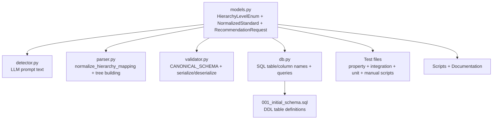

# Design Document: Hierarchy Level Rename

## Overview

This is a systematic rename/refactoring across the entire ELS pipeline codebase. The hierarchy levels change from Domain → Subdomain → Strand → Indicator to Domain → Strand → Sub-strand → Indicator. The rename touches every layer: Python enums, Pydantic models, LLM prompts, JSON schemas, SQL migrations, database queries, serialization logic, and all test files.

The key mapping is:

- `SUBDOMAIN` / `subdomain` → `STRAND` / `strand` (enum value changes from `"subdomain"` to `"strand"`)
- `STRAND` / `strand` → `SUB_STRAND` / `sub_strand` (enum value changes from `"strand"` to `"sub_strand"`)
- `DOMAIN` and `INDICATOR` remain unchanged.

**Critical ordering concern**: Because the old `strand` name collides with the new `strand` name (which was formerly `subdomain`), renames must be done carefully. The approach is to rename old `strand` → `sub_strand` first, then rename old `subdomain` → `strand`, to avoid collisions.

## Architecture

The change is purely a rename with no architectural modifications. The existing 4-level hierarchy structure, depth normalization logic, and data flow remain identical. Only identifiers (enum values, field names, table names, column names, JSON keys, prompt text) change.

### Affected Components



````

## Components and Interfaces

### 1. models.py Changes

**HierarchyLevelEnum**:
```python
class HierarchyLevelEnum(str, Enum):
    DOMAIN = "domain"
    STRAND = "strand"          # was SUBDOMAIN = "subdomain"
    SUB_STRAND = "sub_strand"  # was STRAND = "strand"
    INDICATOR = "indicator"
````

**NormalizedStandard**:

```python
class NormalizedStandard(BaseModel):
    ...
    domain: HierarchyLevel
    strand: Optional[HierarchyLevel] = None       # was subdomain
    sub_strand: Optional[HierarchyLevel] = None    # was strand
    indicator: HierarchyLevel
    ...
```

**RecommendationRequest**:

```python
class RecommendationRequest(BaseModel):
    ...
    strand_code: Optional[str] = None  # was subdomain_code
    ...
```

### 2. parser.py Changes

**normalize_hierarchy_mapping**: Update returned enum values:

- 3 levels: `{0: DOMAIN, 1: STRAND, 2: INDICATOR}` (was SUBDOMAIN at index 1)
- 4+ levels: `{0: DOMAIN, 1: STRAND, 2: SUB_STRAND, 3: INDICATOR}` (was SUBDOMAIN/STRAND)

**build_hierarchy_tree**: Rename dict keys from `"subdomains"` to `"strands"` and `"strands"` to `"sub_strands"`. Update variable names accordingly.

**extract_standards_from_tree**: Update field references from `subdomain`/`strand` to `strand`/`sub_strand`.

**parse_hierarchy**: Update all references to `HierarchyLevelEnum.SUBDOMAIN` → `HierarchyLevelEnum.STRAND` and `HierarchyLevelEnum.STRAND` → `HierarchyLevelEnum.SUB_STRAND`. Update variable names (`current_subdomain` → `current_strand`, `current_strand` → `current_sub_strand`).

### 3. detector.py Changes

**build_detection_prompt**: Update the LLM prompt text:

- Level descriptions: "strand" (depth 2) instead of "subdomain", "sub_strand" (depth 3) instead of "strand"
- JSON output format: `"level": "domain|strand|sub_strand|indicator"`
- All example mappings updated
- Confidence guidance text updated

### 4. validator.py Changes

**CANONICAL_SCHEMA**: Rename `"subdomain"` key to `"strand"` and `"strand"` key to `"sub_strand"` in the JSON schema definition.

**\_validate_schema**: Update all field path references from `standard.subdomain` to `standard.strand` and `standard.strand` to `standard.sub_strand`.

**serialize_record**: Output `"strand"` and `"sub_strand"` keys instead of `"subdomain"` and `"strand"`. Read from `standard.strand` and `standard.sub_strand` model fields.

**deserialize_record**: Read `"strand"` and `"sub_strand"` keys from JSON. Map to `strand=` and `sub_strand=` constructor args.

### 5. db.py Changes

**persist_standard**:

- Insert into `strands` table (was `subdomains`) using `standard.strand`
- Insert into `sub_strands` table (was `strands`) using `standard.sub_strand`
- Update `indicators` table column references: `strand_id` (was `subdomain_id`), `sub_strand_id` (was `strand_id`)

**get_indicators_by_country_state**:

- Parameter rename: `subdomain_code` → `strand_code`
- Table alias: `sub` → `str` for strands, `str` → `substr` for sub_strands
- Column aliases in SELECT: `strand_code`, `strand_name`, `sub_strand_code`, `sub_strand_name`

**query_similar_indicators**: Update JOIN aliases if strands table is referenced.

### 6. Migration Changes (001_initial_schema.sql)

Since this is the initial schema (not an incremental migration), the DDL is updated in place:

- `CREATE TABLE subdomains` → `CREATE TABLE strands`
- `CREATE TABLE strands` → `CREATE TABLE sub_strands`
- Foreign keys updated: `sub_strands.strand_id REFERENCES strands(id)`
- `indicators` table: `strand_id` (was `subdomain_id`), `sub_strand_id` (was `strand_id`)

## Data Models

No structural changes to data models beyond field/enum renames described above. The hierarchy remains a 4-level tree with optional middle levels based on depth detection.

## Correctness Properties

_A property is a characteristic or behavior that should hold true across all valid executions of a system — essentially, a formal statement about what the system should do. Properties serve as the bridge between human-readable specifications and machine-verifiable correctness guarantees._

Property 1: Depth-based normalization produces correct level mapping
_For any_ set of detected elements with N distinct levels, the `normalize_hierarchy_mapping` function should return: 2 levels → {DOMAIN, INDICATOR}, 3 levels → {DOMAIN, STRAND, INDICATOR}, 4+ levels → {DOMAIN, STRAND, SUB_STRAND, INDICATOR}. No output should ever contain the old SUBDOMAIN enum value.
**Validates: Requirements 4.1, 4.2, 4.3**

Property 2: Serialization round-trip preserves hierarchy fields
_For any_ valid NormalizedStandard (with any combination of strand/sub_strand being None or populated), serializing via `serialize_record` then deserializing via `deserialize_record` should produce an equivalent NormalizedStandard with matching `strand` and `sub_strand` values.
**Validates: Requirements 6.2, 6.3**

Property 3: Serialized output uses new field names exclusively
_For any_ valid NormalizedStandard, the output of `serialize_record` should contain keys `"strand"` and `"sub_strand"` under `"standard"`, and should never contain the key `"subdomain"`.
**Validates: Requirements 6.2**

## Error Handling

No new error handling is required. Existing error handling patterns remain unchanged — only the identifiers within error messages and field paths change (e.g., `"standard.subdomain.code"` becomes `"standard.strand.code"` in validation error paths).

## Testing Strategy

**Approach**: This is a rename refactoring. The primary testing concern is ensuring no references to old names remain and that all existing tests pass with the new names.

**Property-based tests**: Use `hypothesis` (already configured in the project). Minimum 100 iterations per property test.

- Property 1: Generate random element sets of varying depths, verify normalization mapping.
- Property 2: Generate random NormalizedStandard objects, verify serialize/deserialize round-trip.
- Property 3: Generate random NormalizedStandard objects, verify serialized output keys.

**Unit/Integration tests**: Update all existing tests in `tests/` to use new names. No new unit tests needed beyond verifying the rename is complete.

**Manual verification**: After all code changes, run `grep -r "subdomain" src/ tests/` to confirm no old references remain (excluding comments explaining the rename).

**Tag format**: `Feature: hierarchy-level-rename, Property {N}: {title}`
